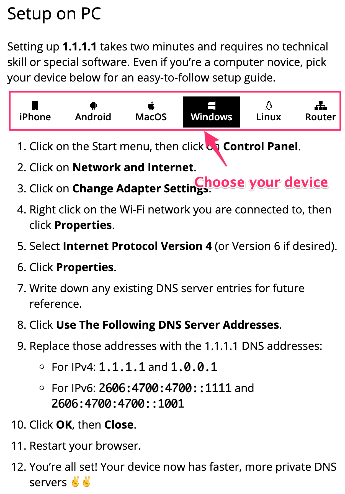
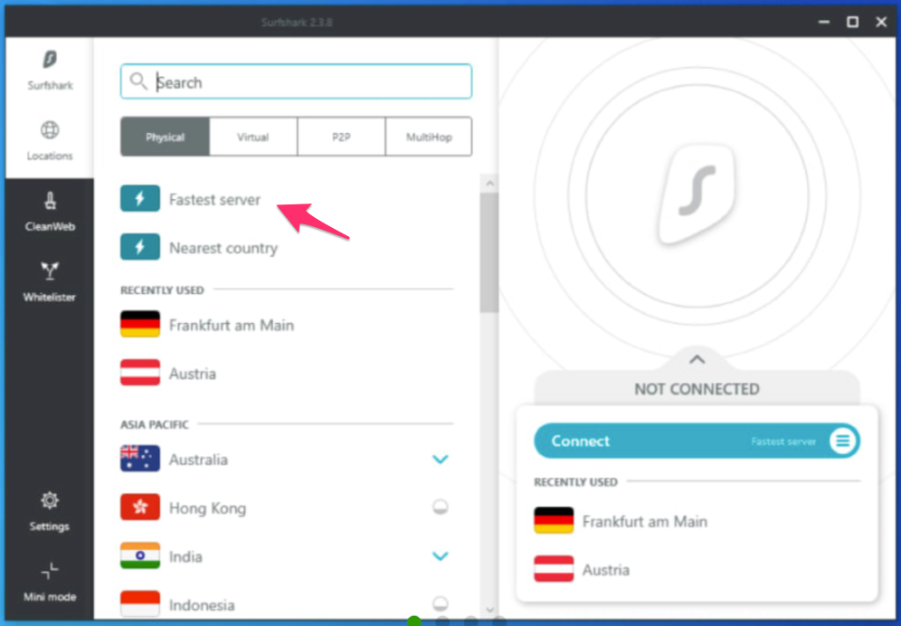

### Can't access Remitano (remitano.com)? Try following options to access:

## 1. Set DNS to 1.1.1.1

You can follow instructions at [https://1.1.1.1/dns/](https://1.1.1.1/dns/) to set up DNS for your devices. To sum up, you will set DNS to
```
1.1.1.1
1.0.0.1
```
Below is the instruction for Windows, and you can also click other tab to see instruction for other devices.



## 2. Use our official proxy hub domains:

A proxy site allows you to bypass blocks setup by your Internet provider.


| Site        | Country           | Speed (ms) |
| ------------- |:-------------:| -----:|
| **remitano.me** |  | 260
| **remitano.biz** |  | 66
| **remitano.net** |  | 60
| **remitano.today** |  | 55
| **remitano.world** |  | 103

### More Information

> Remitano may be blocked on some ISP's around the world.

> After you access the remitano website by one of the above ways, you can sign in to your account and make transactions as always. All of your trading activities on the above domains will take place the same as on our main website remitano.com.

> Your account is secured with these official domains (you can verify this information with our official announcement from our official support hub: [http://support.remitano.com/en/articles/5153519-alternative-domains](http://support.remitano.com/en/articles/5153519-alternative-domains)). If you have any concerns, please do not hesitate to contact our 24/7 Customer Support.

## 3. Use VPN

Or you can also use a reputable VPN service provider such as [SurfShark VPN](https://surfshark.com/download) or free VPN [1.1.1.1](https://1.1.1.1/). Here is sample steps to use wiht SurfShark but mostly the same with other apps:

To connect to the SurfShark VPN, follow these 3 simple steps:

Step 1: Download and install the SurfShark VPN software at https://surfshark.com/download to your device (supported all devices from PC to mobiles)

Step 2: Use SurfShark to connect to the internet from one of the available locations. For instance, I've changed my nationality to Singapore. Then I'll wait for the VPN to load my option.



Step 3: The final step is to log in to the Remitano website (https://remitano.com) normally and access your account.
